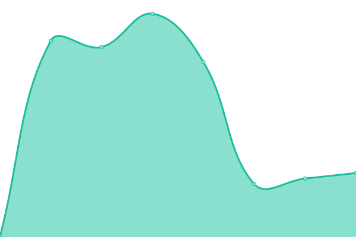

# [📈 Live Status](https://janik6n.github.io/upptime): <!--live status--> **🟧 Partial outage**

This repository contains the open-source uptime monitor and status page for [Jani Karhunen](https://janik6n.net), powered by [Upptime](https://github.com/upptime/upptime).

With [Upptime](https://upptime.js.org), you can get your own unlimited and free uptime monitor and status page, powered entirely by a GitHub repository. We use [Issues](https://github.com/janik6n/upptime/issues) as incident reports, [Actions](https://github.com/janik6n/upptime/actions) as uptime monitors, and [Pages](https://janik6n.github.io/upptime) for the status page.

<!--start: status pages-->
<!-- This summary is generated by Upptime (https://github.com/upptime/upptime) -->
<!-- Do not edit this manually, your changes will be overwritten -->
<!-- prettier-ignore -->
| URL | Status | History | Response Time | Uptime |
| --- | ------ | ------- | ------------- | ------ |
|  [janik6n.net](https://janik6n.net/) | 🟩 Up | [janik6n-net.yml](https://github.com/janik6n/upptime/commits/master/history/janik6n-net.yml) | 

 456ms
     
 | 

<a href="https://janik6n.github.io/upptime/history/janik6n-net">99.02%</a>
    

|  [appdeps.com](https://appdeps.com/) | 🟥 Down | [appdeps-com.yml](https://github.com/janik6n/upptime/commits/master/history/appdeps-com.yml) | 

 0ms
     
 | 

<a href="https://janik6n.github.io/upptime/history/appdeps-com">0.00%</a>
    

<!--end: status pages-->

[**Visit our status website →**](https://janik6n.github.io/upptime)

## 📄 License

- Powered by: [Upptime](https://github.com/upptime/upptime)
- Code: [MIT](./LICENSE) © [Jani Karhunen](https://janik6n.net)
- Data in the `./history` directory: [Open Database License](https://opendatacommons.org/licenses/odbl/1-0/)
